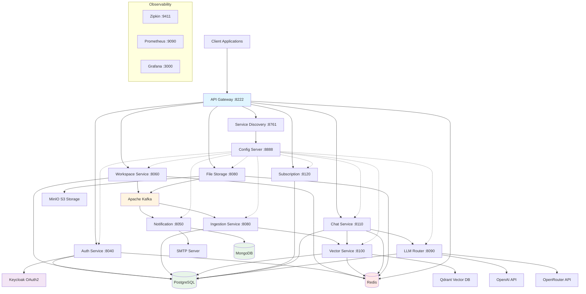
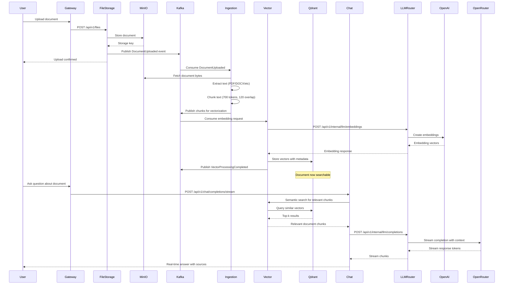

# Nuvine

<p align="center">
  
  
  
  
  
  
  
  
  
  
  
  
  
</p>

Nuvine is a cloud-native, AI-powered knowledge management platform built with a microservices architecture. The platform
enables teams to organize, process, and interact with their documents using advanced RAG (Retrieval-Augmented
Generation) capabilities, semantic search, and conversational AI. Built on Spring Boot 3.5 and Java 21, Nuvine leverages
modern distributed systems patterns including event-driven architecture, service mesh, and distributed tracing to
deliver a scalable, resilient solution for enterprise document intelligence.

## 🏗️ Architecture Overview

Nuvine consists of 12 microservices orchestrated through Docker Compose, communicating via Apache Kafka for asynchronous
events and HTTP/REST for synchronous operations. The architecture follows Domain-Driven Design principles with clear
bounded contexts and a layered approach.

### 🗺️ System Architecture



### 🔄 Document Processing Pipeline



## 🧰 Tech Stack

- **Platform**: Java 21, Spring Boot 3.5 (Spring Cloud)
- **Messaging**: Apache Kafka
- **Datastores**: PostgreSQL (primary), Redis (cache/rate limiting), MongoDB (notifications)
- **Auth**: Keycloak (OAuth2/OIDC)
- **Storage**: MinIO (S3)
- **AI/RAG**: Qdrant (vector DB), OpenAI + OpenRouter (LLM/embeddings)
- **Observability**: Prometheus, Grafana, Zipkin, Micrometer

## 🚀 Quick Start

### ✅ Prerequisites

Ensure you have the following installed:

- Docker 25.0+ and Docker Compose
- Java 21 JDK (for local development)
- Maven 3.9+ (for building services)

### 🧩 Environment Variables

The platform requires a `.env` file in `infra/docker`. Copy `.env.example` and adjust the values:

```bash
cp .env.example infra/docker/.env
```

Key groups included in `.env.example`:

- **Service databases (PostgreSQL)**: `AUTH_DB_*`, `WORKSPACE_DB_*`, `CHAT_DB_*`, `SUBSCRIPTION_DB_*`, `INGESTION_DB_*`,
  `LLM_ROUTER_DB_*`, `VECTOR_DB_*`
- **Notification database (MongoDB)**: `NOTIFICATION_MONGO_*`
- **Auth/identity (Keycloak)**: `KC_*`, `KEYCLOAK_*`, plus per-service client secrets `KEYCLOAK_*_SERVICE_SECRET`
- **Messaging**: `KAFKA_HOST`
- **Vector DB**: `QDRANT_HOST`
- **Object storage (MinIO)**: `MINIO_*`
- **Email (notifications)**: `NOTIF_MAIL_*`
- **LLM providers**: `OPENAI_API_KEY`, `OPENROUTER_API_KEY`
- **Frontend/Stripe/Redis**: `FRONTEND_URL`, `STRIPE_*`, `REDIS_PASSWORD`

Keycloak realm/client setup: see `infra/keycloak/KEYCLOAK_SETUP.md` (realm import + client secrets).

### 🐳 Running with Docker Compose

1. Create env file:
   ```bash
   cp .env.example infra/docker/.env
   ```

2. Configure Keycloak realm export + client secrets:
   See `infra/keycloak/KEYCLOAK_SETUP.md`.

   If you need to re-import the realm, delete the Keycloak Docker volume and restart (details in the guide).

3. Start the stack:
   ```bash
   cd infra/docker
   docker compose up -d
   ```

Access the platform:

- API Gateway: http://localhost:8222
- Keycloak Admin: http://localhost:9098 (admin credentials in `.env`)
- Grafana: http://localhost:3000
- Prometheus: http://localhost:9090
- Zipkin: http://localhost:9411
- MinIO Console: http://localhost:9001

## 🔭 Observability

Nuvine ships with built-in observability via Prometheus metrics and pre-provisioned Grafana dashboards.

- **Grafana dashboards**: `infra/grafana/dashboards/`
  - `infra/grafana/dashboards/nuvine-observability.json`
  - `infra/grafana/dashboards/nuvine-http-endpoints.json`
  - `infra/grafana/dashboards/nuvine-jvm-gc.json`
- **Grafana provisioning** (datasources + dashboards): `infra/grafana/provisioning/`
- **Prometheus scrape config**: `infra/docker/prometheus.yml` (scrapes `/actuator/prometheus` on services)

### 🧪 Running Tests

```bash
# Run all tests
mvn test

# Run tests for specific service
cd services/auth
mvn test

# Run with coverage
mvn test jacoco:report
# Report: target/site/jacoco/index.html

# Run integration tests only
mvn test -Dgroups=integration
```

## 🧩 Service Details

### ⚙️ Config Server

Centralized configuration server. All microservices fetch configuration from this service on startup.

- **Port**: `8888`
- **Tech**: Spring Cloud Config Server (Git backend)
- **Dependencies**: None (start first)

### 🧭 Discovery Service

Service registration and discovery via Eureka.

- **Port**: `8761`
- **Tech**: Spring Cloud Netflix Eureka
- **Dependencies**: Config Server

### 🚪 API Gateway

Unified entry point for routing, authentication, rate limiting, and CORS.

- **Port**: `8222`
- **Tech**: Spring Cloud Gateway, Redis (rate limiting)
- **Key Routes**: `/api/v1/auth/*`, `/api/v1/workspaces/*`, `/api/v1/files/*`, `/api/v1/chat/*`,
  `/api/v1/subscription/*`

### 🔐 Auth Service

User registration/auth, email verification, password reset, and JWT issuance.

- **Port**: `8040`
- **Tech**: Spring Security, Keycloak, PostgreSQL, Redis, Kafka
- **Key Endpoints**: `/api/v1/auth/register`, `/api/v1/auth/login`, `/api/v1/auth/verify-email`,
  `/api/v1/auth/reset-password`

### 🗂️ Workspace Service

Multi-tenant workspace/projects/documents with RBAC and invitations.

- **Port**: `8060`
- **Tech**: Spring Boot, PostgreSQL, Redis, Kafka
- **Key Endpoints**: `/api/v1/workspaces/*`, `/api/v1/projects/*`, `/api/v1/documents/*`, `/api/v1/members/*`

### 📦 File Storage Service

S3-compatible file storage via MinIO, presigned URLs, file metadata, and upload events.

- **Port**: `8080`
- **Tech**: Spring Boot, AWS SDK for Java, MinIO, Redis, Kafka
- **Key Endpoints**: `/api/v1/files/upload`, `/api/v1/files/{id}`, `/api/v1/files/{id}/presigned-url`

### 🧾 Ingestion Service

Document processing orchestrator: extract text, chunking, and vectorization coordination.

- **Port**: `8080`
- **Tech**: Spring Boot, Apache PDFBox, Apache POI, PostgreSQL, Kafka
- **Supported Formats**: PDF, DOCX, PPTX, HTML, Markdown, Plain Text
- **Key Endpoints**: `/api/v1/internal/ingestion/jobs`, `/api/v1/internal/ingestion/jobs/{id}/start`

### 🧠 Vector Service

Embeddings + semantic search using Qdrant.

- **Port**: `8100`
- **Tech**: Spring Boot, Qdrant (gRPC), PostgreSQL, Redis, Kafka
- **Key Endpoints**:
  ```text
  /api/v1/internal/vector/search
  /api/v1/internal/vector/search-by-text
  /api/v1/internal/vector/collections/{id}
  ```

### 🧠➡️ LLM Router Service

Unified gateway for LLM completions/embeddings with provider routing and circuit breakers.

- **Port**: `8090`
- **Tech**: Spring Boot, OpenAI Java Client, WebClient, Resilience4j, PostgreSQL, Kafka
- **Key Endpoints**:
  ```text
  /api/v1/internal/llm/completions
  /api/v1/internal/llm/completion/stream
  /api/v1/internal/llm/embeddings
  ```

### 💬 Chat Service

RAG-powered conversational AI with streaming and conversation history.

- **Port**: `8110`
- **Tech**: Spring Boot, PostgreSQL, Redis, Kafka, WebFlux
- **Key Endpoints**: `/api/v1/chat/completions`, `/api/v1/chat/completions/stream`, `/api/v1/chat/conversations/*`

### ✉️ Notification Service

Event-driven email delivery: consumes Kafka events, renders templates, stores notification records.

- **Port**: `8050`
- **Tech**: Spring Boot, MongoDB, Kafka, JavaMailSender, Thymeleaf
- **Notification Types**: user registration, email verification, password reset, workspace invitations, payment
  notifications

### 💳 Subscription Service

Billing, quotas, Stripe integration, webhooks, and customer portal.

- **🔌 Port**: `8120`
- **🧰 Tech**: Spring Boot, Stripe Java SDK, PostgreSQL, Redis, Kafka
- **🧩 Key Endpoints**: `/api/v1/billing/*`, `/api/v1/subscription/*`, `/api/v1/usage/*`

## 🗄️ Database Migrations

Services use Flyway for database migrations. Migrations run automatically on startup.

```bash
# Manually run migrations
cd services/auth
mvn flyway:migrate

# Rollback last migration
mvn flyway:undo

# Check migration status
mvn flyway:info
```

## 🤝 Contributing

Development follows standard Git workflow:

1. Create feature branch: `git checkout -b feature/your-feature`
2. Make changes and test locally
3. Run tests: `mvn test`
4. Commit with conventional commits: `git commit -m "feat: add new feature"`
5. Push and create pull request

## 📄 License

This project is licensed under the **MIT License** — see the [LICENSE](./LICENSE) file for details.
